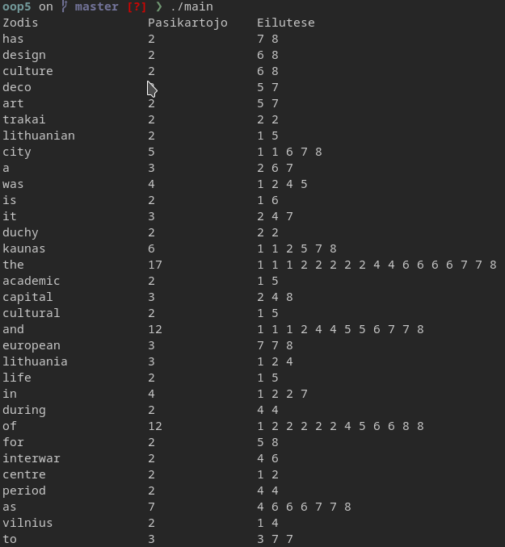
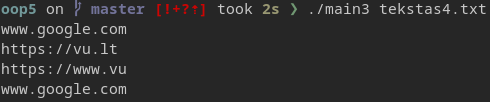

# Penktoji objektinio programavimo užduotis

Šioje repozitorijoje yra dvi programos, pirmoji (main) nuskaito tekstinį failą, išvedą į kitą failą žodžius kurie kartojasi daugiau nei vieną karta, ir į consolę išvedą lentelė kurioje taip pat nurodyta kuriose eilutėse tie žodžiai buvo

## Kaip parunnint

 - `git clone https://github.com/dominykasmk/oop5.git`
 - `cd oop5`
 - `cmake -S src/ -B out/`
 - `cd out/ && make`
 - `./main`

--

 - `g++ main3.cpp -o main3`
 - `./main`

